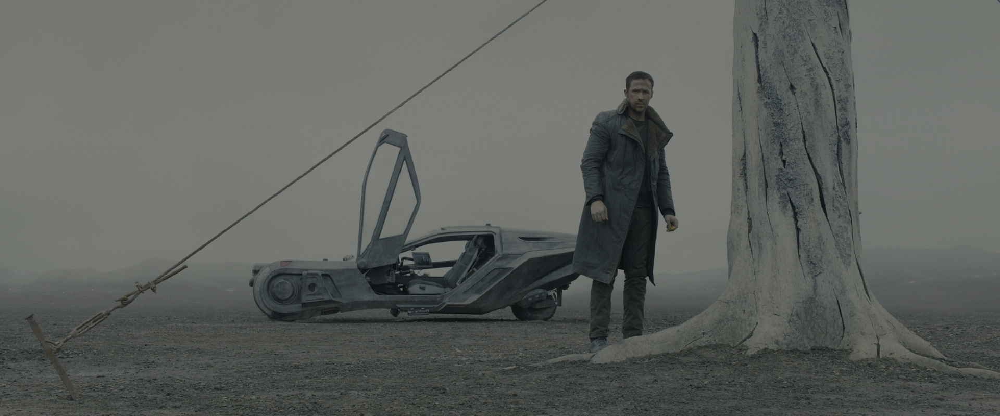

## 起因

也是没什么特别的。因为疫情被封楼关在家中，本来的出行扫街计划全部泡汤，加上脚底淤血，肿胀疼痛难忍，只得穿了弹力袜，两脚架起，然后重新把以往的电影再看一遍。

当然，《银翼杀手（Blade Runner）》以及其续集《银翼杀手 2049》本身也是我非常喜欢的电影。

加上以往稍微扒拉过一些资料，因此干脆把这次观影感想写成一篇杂考。

## 1982 版

1982 版的剧本蓝本是菲利普・迪克的《仿生人会梦见电子羊吗？》一书。数年前曾有幸拜读，也曾听闻众人对原著以及被改得几乎“面目全非”的电影版的评论。我自己的想法是：各有千秋。

原著中对赛博朋克（Cyberpunk）的「高科技、低生活（High tech low life）」的描写着墨更多，从起床后的情绪调节器，到防辐射尘的铅护裆，再到动物的真真假假——一幅血淋淋的现实就这么铺展在了眼前。而原著中的银翼杀手 Deckard，接下这个任务的原因也只是为了凑够钱买一只真的羊养在楼顶，而 Deckard 夫妇两人以及邻居们现在养着的则都是仿生动物。所有的一切都发生在 24 小时之内，没有电影版的追凶，没有精彩的打斗，更没有结尾那震撼人心的台词，如果非要概括，那就是一个虚荣心驱使、猎杀在逃仿生人的故事。但就是这么一个看似无趣的故事，也足以引发对人性的思考。

而电影版导演雷德利・斯科特老爷子对剧本大刀阔斧的改编不可谓不大胆。砍掉很多会影响电影节奏的儿女情长自不必说，对于主角身份的反复，以及故事的起承转合，都进行了修改。也难怪当时剧本会被评论家大骂不尊重原著，这分明是雷导和编剧自己写的故事了嘛。但尽管与原著相去甚远，也丝毫没有影响全片几乎成为后世赛博朋克经典模板。无论是构图、光影、人物设计，还是永远下着瓢泼大雨的、 压抑到窒息的城市，都被后来者纷纷效仿。而探究起雷导为何会让整个场景整天下雨，答案竟是：剧组当时没钱，只能在夜里租借场地，背景板也是画的，下着瓢泼大雨才能尽量少让镜头穿帮。

此外出于节奏的考量，电影版其实还欠缺了很多解释，导致全片初看云里雾里。例如在最初反复出现的 _Voigt-Kampff_ 问答测试，这个元素在原作中贯穿全篇，测试的目的就是看对象能否产生「共情（Empathy）」，通过瞳孔的波动、虹膜不自觉的扩大、微血管扩张等指标来判断是否为人类。这个测试假借了图灵测试，稍作变化，变成了测试动物的共情能力。而这个测试诞生的更大背景则是 Deckard 这一代人是核战后看着动物慢慢灭绝的一代人，不仅将现有的动物（非仿生）看得十分重要甚至神圣，还认为核战前人类对动物的杀害是极其残忍的，更不必说当下动物已几近灭绝，如果还有谁对动物下狠手，那多半就不是（那个环境下、那个时代的）人类了。其实 Deckard 在原著中也被问及了「如果人类测试阳性呢？」这一问题，这位银翼杀手也是一时语塞，只得说自己从没错误「退役」过人类。

## 比人类更像人类

全片中关于仿生人，印象最深刻的自然是复制人之父 Tyrell 的那句无比自豪的介绍：

> More human than human.

直译：

> 比人类更像人类。

光从这句介绍上看，似乎仿生人比起人类更加优秀，由于拥有科技加持的身体以及头脑，可以更广泛地胜任人类所不能之事。然而事实上这些拥有着强壮体魄、机敏头脑的仿生人，到头来却是在地外世界（Outer world）作为奴工、苦力、甚至战争炮灰来使用。甚至他们还被限定了存活时间，并且被认为在情感上低人一等。

而为了更好地控制仿生人，Tyrell 想出了为仿生人植入「记忆」。1982 版中将真人（Tyrell 的侄女）的记忆装填至 Rachel 脑中，让她以为自己拥有同年，是一个人类。Tyrell 对她隐瞒了真相，但还是敌不住 Deckard 的老辣，在被询问上百个问题后终于被发现是仿生人。Deckard 也非常诧异于这一手段的效果，而后续的故事中也可以发现，Rachel 哪怕知道自己是仿生人，一样举止自然，表现出了愤怒、恐惧、不安，甚至还有人类的「特权」：爱。可以说她真的仿佛一个正常人类，但人类社会并不会接纳她，甚至剧末还要 Deckard 将她一并「退役」。

另一边，作为 Nexus 6 型量产仿生人，反派们的表现也是令人印象极其深刻。

外逃的这些 Nexus 6 型仿生人，由于没有植入的记忆，剧中大半时间表现得正如 Tyrell 所说，情感失调，幼稚，并且残忍。他们解决问题的方式，多半是诉诸暴力与破坏。这些缺少情感基础和体验，难以产生共情的仿生人仿佛受到惊吓，或者生气的孩子，一路打砸。在得知延续自己生命无望后，领头的仿生人亲吻了创造自己的 Tyrell 并残忍地压碎了他的颅骨，并剜出了他的双眼。

那么他们真的是没有人性的吗？我看也不尽然。他们同样有作为生物的本能——活下去。得知自己大限将至之后，寻求活下去的方法怎么说也属于人的，以及动物的本能反应。人造人作为人类的造物，在这事上的反应并不弱于人类。此外，片尾也为我们上演了动人心魄的一幕。

个人而言，全片最经典的莫过于 Roy Batty（由 Rutger Oelsen Hauer 饰演）在片末临死前的独白：

> I've seen things you people wouldn't believe. Attack ships on fire off the shoulder of Orion. I watched C-beams glitter in the dark near the Tannhäuser Gate. All those moments will be lost in time, like tears in rain. Time to die.

直译：

> 我曾见过你们人类难以置信的东西。战舰在猎户座的肩端之外燃烧。我看见了 C 光束在汤豪泽之门附近的黑暗中闪烁。所有这些时刻都将消逝在时间里，就像雨中的泪水。死期已至。

在这之前，面对 Deckard 的枪口，Roy 丝毫不惧，甚至凭借着自己强健的身体以及聪明的战术头脑一路将 Deckard 反逼至绝境，让多年以来「退役」无数仿生人的 Deckard 也体验了一回活在死亡的阴影中是什么感觉。但正当 Deckard 力不从心，即将落下高楼之时，本来一旁疯疯癫癫笑着的 Roy 一手伸出，将 Deckard 拉回天台上。尽管剧中丝毫没有提及为什么他要这么做，一种理解是「人之将死其言也善」，另一种是「他想要证明自己也有怜悯之心，不像人类一样冷酷无情」。

Roy 自知死期将至，无论是哪一种理解，这个行为本身已经证明了他拥有人性。当人类甚至不愿意明说「猎杀」两字而用「退役」遮遮掩掩，甚至将仿生人视作奴隶之时，这个被追杀的仿生人却以德报怨，并留下来这一段经典对白。

对白本身据传似乎是 Hauer 在片场的即兴表演，而原本的台词艰深晦涩、冗长拖沓。Hauer 即兴的版本相比之下不仅体现出了仿生人的「见多识广」，也说明了他们同样对死亡有着自己的理解。这段对白令人动容之处，想必就在这里。

## 续集：2049

由于《银翼杀手（1982）》的极高成就，其实在上映前我对《银翼杀手 2049》是心里极度不安的。毕竟在此之前，各类青史留名的电影，它们的续集大多是狗尾续貂，质量根本无从谈起。此外导演也不再是雷老爷子，更是让我在心里为影片质量打了个巨大的问号。

当然没成想，续集竟然把故事很好地续写了下去，并且似乎将 1982 版中的伏笔以及线索延续了下去。一并延续下去的还有以往的视觉设计，以及运镜。干净规整的构图让我觉得十分舒坦。

另外，Gosling 那张看似缺乏表情的脸，倒是格外适合饰演仿生人警探「K」。

### “你们从未见证过奇迹”

开篇第一件事便是 K 找出了一个潜伏许久的逃亡仿生人。此时的仿生人已经被放松限制（寿命、情感），但是仍被禁止回到地球，并在地外世界继续遭受着奴役。被追杀的仿生人在最后抛下一句“因为你们从未见证过奇迹”便主动倒在 K 的枪口之下。退役完仿生人，K 追查了到了一具遗骨，在经过鉴定后发现这句遗骨属于一个仿生人女性，并且有**生育**过的迹象。

代表人类与秩序一方的局长下令将孩子找出并处理掉，目的很明确：维护当下的稳定，绝对不能让仿生人出现「生育」这一行为，即便已经见到了事实，也要将其抹杀。生育对于人类，以及其他动物而言，是延续种族以及生命的基础。一直以来被视为人类造物甚至玩物的仿生人，竟然也完成了延续生命的行为，对于人类而言，「后患」无穷无尽。

在另一边，Tyrell 的继任者同样也想找到这个孩子。对他而言，他并不关心仿生人可以完成「生育」会对社会造成多大，他更关心仿生人可以自行生育后对公司而言可以以更低成本创造更多商品。将生命的延续商品化、商业化，成为公司利益的一部分，从生命中榨取每一滴剩余价值，这样的思考方式和行为模式，相比起愿意守护奇迹之子相关秘密而选择牺牲的仿生人，人性可以说是丧失殆尽。

说到新型号的仿生人，续集中延续了 1982 版的故事，为仿生人植入了记忆，从而使他们更容易受到控制、行为更加自然。他们甚至可以仅通过听取当时 Deckard 与 Rachel 的只言片语，便明白 Rachel 正在挑逗 Deckard。就连作为警探型号，一向无情的 K 也在追捕过程中因为自己的记忆似乎属实，逐渐开始怀疑自己是不是就是那个孩子，并无法通过基准测试，险遭「退役」。当仿生人获得了记忆、获得了理解情感的能力后，他们与人类的界限进一步模糊，想到原著中人类需要靠着拨弄情绪调节器来变换心情，仿生人却多愁善感，甚至人类常见的贪、嗔、痴也一样不缺，更是百感交集。到底什么是人性？谁更像人类？

### 泪水消失在雨中

影片的后半段是 K 放弃职务后不断追查并回到了 1982 版故事的所在地洛杉矶。

漫天黄沙直接让人勾起了雾气缭绕、终年下雨的 1982 版场景。蜜蜂的活跃似乎又在嘲笑人类退走后生态逐渐恢复。赌场中昔日的余晖在没有了人类之后也是暗淡无光。

而已经年老的 Deckard 出现更是让人一惊，尽管 1982 版由于导演剪辑版中银色独角兽等等线索，普遍认为 Deckard 也是仿生人而不自知，但似乎 2049 采纳了他是人类的设定。此刻的他多疑、拒人于千里之外，但同时也担心自己的孩子安危。与 K 搏斗许久后终于败下阵来，但也没有告诉 K 多少有用的信息。反倒是突然出现的敌方掳走了 Deckard，并且将 K 承载几乎视作爱人的 Joi 的储存装置一脚踩碎，Joi 连最后一句「I love you」都没能说完。仿生人到底是有人性，还是无情无义呢？

一直到最后，已经一无所有的 K 在经过一番争斗，终于救出 Deckard 将其带到自己孩子面前后，自己因身负重伤而倒在雪地里。这一场景尽管毫无台词，但却和 1982 版最后 Roy 的独白遥相呼应——不管自己经历过什么，做过什么，最后都将如同泪水消失在雨中。

2049 的故事尽管不是那么新颖，但是足够百转千回，也够吊人胃口。与 1982 版中情感不协调、人类与仿生人仍然有区别的设定不同，在续集中人性的界限被进一步模糊，很多时候都早已忘记这些在争斗、在勾心斗角的是仿生人而不是人类。加之剧中人类的冷酷无情，甚至一时间难以分辨究竟谁才真的拥有人性的光辉，也难怪在短篇集《Blade Runner Black Out 2022》中会有认为仿生人如同天使般纯洁，并愿意为了她而在洛杉矶上空引爆核弹、用 EMP 造成大停电并摧毁数据库。Tyrell 已死，但他的继承者利用他遗留下来的方法，并且在人类自己人性日渐丧失的背景下，完成了他试图令仿生人「比人类更像人类」的目标。而仿生人反抗军的旗号也同样是这句话，不知道 Tyrell 若是黄泉有知，会作何感想。

## 结语

《银翼杀手》和《银翼杀手 2049》因其艰深晦涩、设定背景复杂等原因实际上一直都是叫好不叫座。《银翼杀手》自不必说，当时的投资人对这部电影极其不看好，票房也确认了这一点，但是丝毫没有影响其在影史上的地位。备受关注的 2049 在上映首日的票房仅 1260 万美元，更是说明了受众之窄。但是幸而有丹尼斯・维伦纽瓦操刀执导，雷老爷子作为制片人，而上一部的编剧汉普敦・芬奇也同时回归，因此整片延续了前作的节奏和质量，并没有搞成常见的狗尾续貂。故事在原先的基础上进一步扩展了仿生人与人类的斗争，更深入地探讨了人性何在的问题。个人而言是非常喜欢这部电影的。
