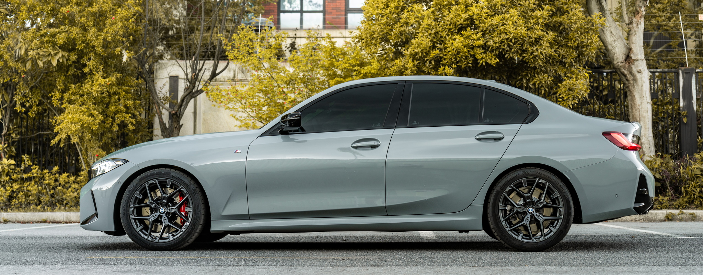
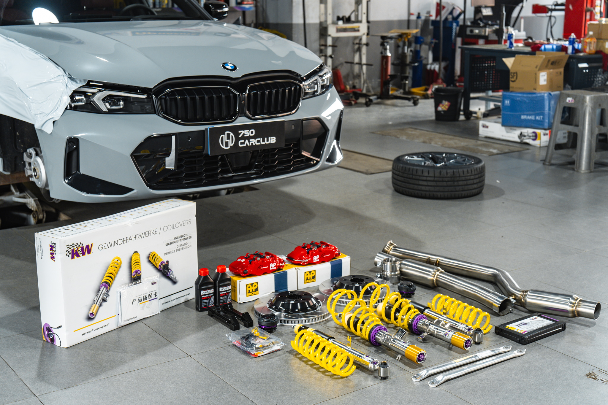
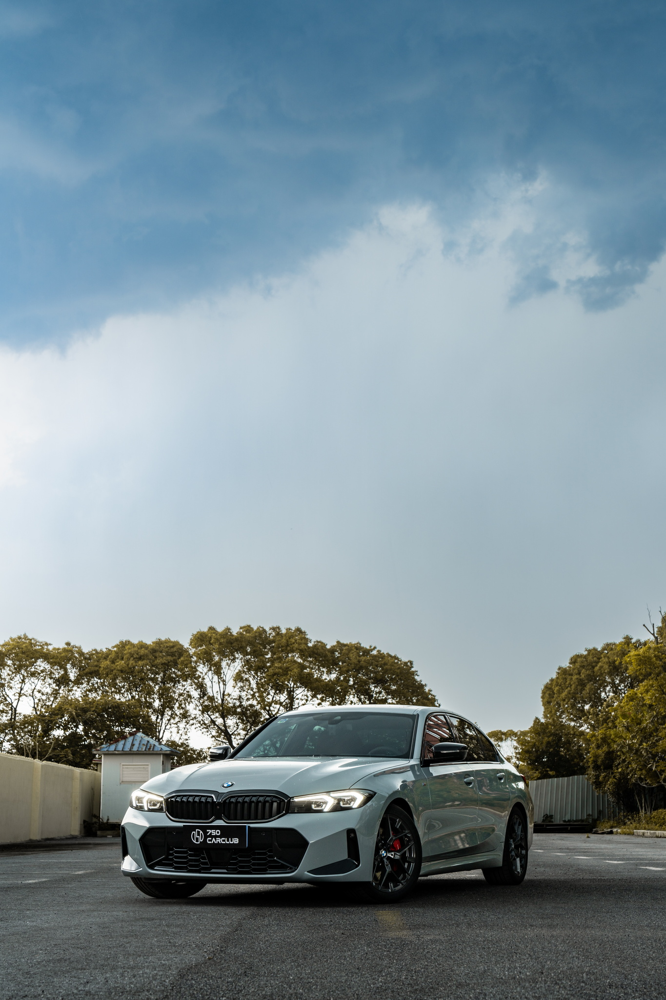
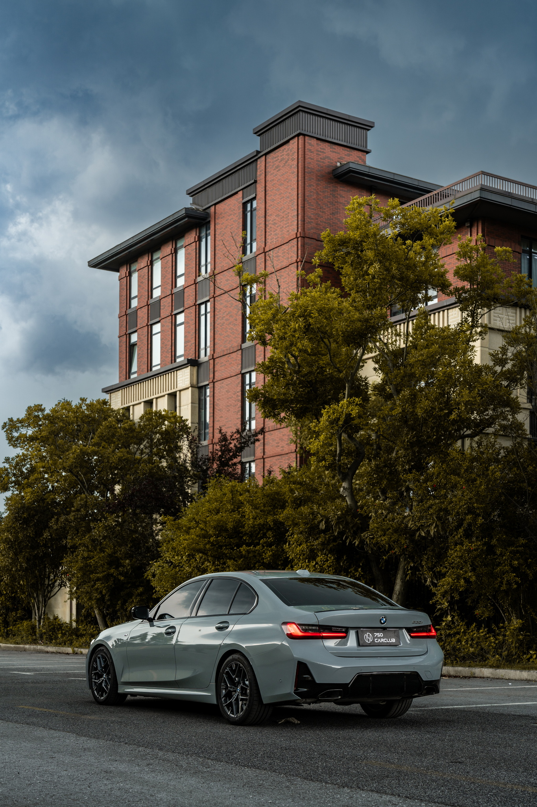
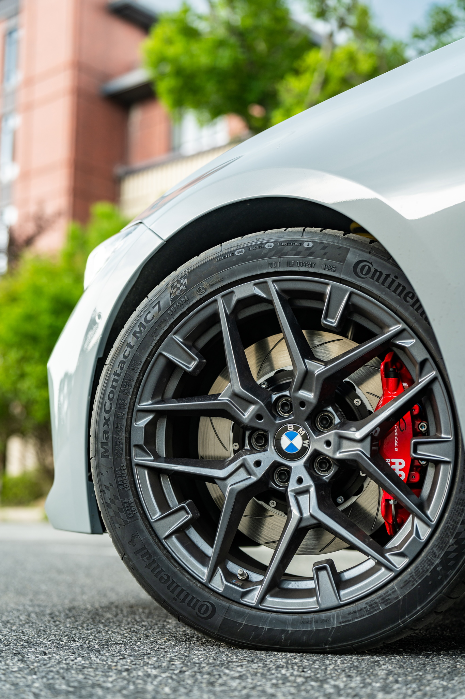

## 新车

这辆 BMW 330i (G20) 是我人生中第一辆自己买的车。之前一辆车是老爸送我的丰田 RAV4，车体大，车身长，动力差，配置低，作为练手倒是刚好，但开久了就觉得不满足，正好这辆车快要 6 年上线年检，遂决定换车。前前后后做了 3 个月功课，看了不少车型，正好说说几辆试驾和看过的。

- Volvo S60。这辆其实是看得最久的。作为医生，在 Volvo 我有职业优惠，并且 S60 的灰色我还挺喜欢的，就去展厅看了一下，试驾后有几个点最终促使我放弃它。
  1. 动力顺滑但并不满足，并且 4S 店直接告知我顶配 B5 版本厂家基本没有在产，T8 版本则已停产
  2. 配置低，360 摄像头尽管用得少，但它中配版本居然是没有的，只有顶配才给，需要后装副厂
  3. 中控老旧，尽管经典，但 10 年以上没有改款过实在是过分了
  4. 48V 轻混存在后期损坏的风险，并且新车似乎是关不掉自动启停需要刷程序

- Cadillac CT5。CT5 在我看车的那段时间推出了一口价（尽管线下优惠可以继续再谈），并且配置上给得很足：MRC 电磁避震、Brembo 四活塞刹车卡钳，还有经典防撞大梁。但是试驾一坐进去就发现，这车外观挺大，但里面怎么那么小？并且了解之后得知，如今的 LSY 发动机根本带不动通用自己的变速箱，而很显然移植发动机如同心脏移植，总成本远远高于更换避震刹车等配件。所以最后选择了 330i：高功率 B48 动力足够强劲，漏水修复周期和成本可控，显然是更合理的选择。
- Audi A5L。奥迪的 A5L 其实我当时在观望，但迟迟没有消息，而且新车上市必然优惠力度小。加上旧车上线检测和保险过期日子临近，我最终选择不再等待这辆。
- BMW 430i。家里死活不同意双门车，哪怕我后座极少带人。但是四门价格高昂不说，尺寸和普通 3 系基本如出一辙，百公里加速甚至还慢了一点。加上选装件自己看看需要近 9 万，远超负担能力，遂遗憾放弃。

在犹豫不决的时候我翻了翻 BMW 的价格，发现新 3 系的落地价格低得吓人。我对 3 系最后的印象是在疫情期间 325Li 因为芯片荒，需要加价到近 40 万才能提车，最开始看车的时候压根就没想过这辆。没想到价格战的压力之下宝马已经把 3 系压到了如此之低价格（至少在我的心理价位内），遂决定直接冲 330，并且在看过实车和看过各种评测后综合决定买标轴 330i。主要我后排极少坐人，自己开自然是标轴更加舒服。

在等待了一个月后顺利提车。

这张其实已经是升级过后的状态了。我选择的是新下放给 3 系的布鲁克林灰，之前只有 4 系等进口车才有资格选装。这个灰色其实还挺特别，不是国内厂家常见的水泥灰，它在阳光下看实际上有点泛蓝，非常特别。

轮毂的话我思前想后没有上 19 寸，主要还是由于轮胎价格，以及分院路上存在烂路这两点限制。这也影响了我后续刹车的选择。

## 升级

升级主要动的是这几点：轮胎、避震、刹车、排气系统（中段）

### 轮胎

这个是我上来就换掉的。原厂不幸抽中韩泰 K117，查了车友评价后可以说是一塌糊涂。并且自己驾驶的时候也感觉到巨大的胎噪、梆硬的胎壁和间断的打滑。所以过了几天直接换成了 Continental MaxContact 7 (马牌 MC7)。原先其实打算和老车一样用米其林，并且打算用 PilotSport 5，不过看了评测后发现 MC7 花纹更新，性能接近，并且价格相较于 PS5 会低一点，遂决定尝试 MC7。目前发现对比旧车的 Primacy SUV+ 静音性其实并没有差多少；相比原厂防爆胎，操控显著提升，过坑过坎不会再担心鼓包，雨天操控也显著增强。

### 避震

这代 G20 的国内版本，避震已经是全网都在骂的问题了：华晨自作主张把国内版本的 3 系改成了非常非常软的取向，导致变道和相对快速入弯时车身侧倾严重。

查阅相关升级案例后发现几个选择：KW V3、KW V3 LE、BCBR、Bilstein 等都有人选，我思来想去，在手里还有预算的情况下决定一步到上 [KW V3 系列](https://www.kwsuspensions.com/de-en/products/street-performance/v3-coilovers)，并且因为天天上下地库，选择了 [Leveling 版本](https://www.kwsuspensions.com/de-en/products/street-comfort/v3-leveling)，降低了 10mm，保留了约 2 指高度。这样在保证通过性的同时提升了操控，尽管 LE 版本比起 V3 标准版本低趴姿态会略差，但终究还是要过日子的呀。

试车时可以说是给了我耳目一新的感受。车店师傅给我调了最均衡的参数，这已经让我感到十分满足了。到后面封闭路段试车时飞坡过坎，无论何时都感觉车身被牢牢地吸在地面上，并且很少有多余的晃动：原先那种开船感完全消失不见，并且 LE 版本在提升操控、让底盘适度紧绷的同时，增加了相当多的高级感。这感受还真很难用文字完全描述出来，真的需要实际驾驶才能明白提升有多巨大。

另一个改变，在于刹车时的点头现象得到了极大改善。尽管据车主测试，现在生产的 3 系避震，已经比 2020 年上市时硬了不少，但仍然存在刹停时车身点头晃动的现象，而且这个晃动非常难受。更换为 KW V3 LE 后刹停时车身晃动可以迅速被稳定下来，也就是前文所说的“紧绷感”。

### 刹车

刹车其实是和轮毂的选择连在一起的。考虑到 19 寸轮胎的价格，以及潜在的轮胎、轮毂变形风险，我最后没有选择原厂 19 寸轮毂，并且在最初的改装计划里就没有把扩大轮毂尺寸放在里面。主要还是避免交警检查（吃了 1087 可要年年上线），以及减少后续验车时的额外花销和麻烦。

在原厂 1039M 轮毂里能塞下的刹车，六活塞的基本不用想，似乎最好的选择就是 [AP9540](https://apracing.com/performance-upgrades/performance-brake-calipers/world-radi-cal-2-calipers/4-piston-world-radi-cal-2-calipers/cp9540-family-4956cm2-piston-area) 了。这是较新款的大四活塞刹车，比起 9040 等旧款颜值和性能又得到了提升。此外由于 330i 本身大力鼓就足够强大，所以无需更换即可上这些更好的刹车。

刹车脚感也是我更换刹车的一个重要原因。原先我开的 RAV4 是典型的线性刹车，大多日系车也都是这样的设置。宝马的刹车第一次开时非常不适应，前段虚位很大，到某个特定深度后力度瞬间增加，有撞墙一样的感觉。并且由于避震的原因，在短距离刹车（急刹车）和市区拥堵跟车时经常出现点头现象。网上不少车友说通过脚法可以改善，但我尝试多次未果，遂决定把它换掉（同时还增加颜值）。

轮毂的话，原来想用国锻（说白了国内仿品）凑合，但在现场看过后发现细节不能和正品比。其中一款喜欢的 [RAYS G025](https://www.rayswheels.co.jp/en/products/brand/detail/112) 在咨询车店老板后表示 18 寸数据不行，导致国内几乎不备现货，这综合下来发现国锻必被识破，丢不起这个人，遂决定后续想咬咬牙上 [BBS RI-A](https://bbs-japan.co.jp/en/products/1135/) 的。到时候簧下重量继续减轻，操控性应该会更上一层楼。

### 排气（中段）

排气系统我原先是并不想动的。我本身并不喜欢过分夸张的发动机声，更别说 2.0T 4 缸能有多好听的声浪，再加上过大的声浪还会引来 1087 上身，所以排气最开始是不在计划中的。

然而我在搜索国六 b 的 330i 可以用什么机油时发现选择非常受限，原先购买的进口机油也不在京东的兼容列表里。进一步搜索发现是因为 GPF 的加入导致机油必须使用低灰分的版本，还要严格遵守认证以保证 GPF 不堵塞。再深入研究后发现不少车主直接把含 GPF 的中段切除了，随后可选的机油范围明显扩大，且不用担心 GPF 堵塞后影响发动机寿命或需要出大价钱修理排气系统的风险，便把这一项列入了计划。

最开始还在想是不是需要刷程序屏蔽，B 站上这个[关于 MKL 排气](https://www.bilibili.com/video/av635822994)的视频让我看到了希望。视频中改装完也没有变成炸街声，自带 GPF 屏蔽则不需要动程序丢质保，咨询车店老板后也给出了同一个品牌，我就确定了中段更换方案。

升级完后上路测试，最明显的感受就是发动机转速起来明显顺畅很多，并且车内也不需要开自嗨声浪了。而且后续更换 0w-30 机油可以更放心暴力驾驶，此外因为 GPF “假装”存在、头段三元没有动，验车排放不会过不去，这点更改长久来看是一笔相当值得的投资。

## 结语

作为工作后人生中第一辆自己出钱购买的车，这辆 330i 可以说是圆了自己的宝马梦，当然也满足了母亲的宝马梦，我的父亲倒是对车没有什么执念，反而批评我应该把原来的老车继续开而不是买新车（汗）。

这些改装也是我预算内的，所以也在做了大量功课后尽可能地用了好的配件，毕竟是准备开至少 6 年的车。

最后也要感谢 [750 Car Club](https://m.dianping.com/shopshare/G4XG5fxXunVoG35I) 的贺老师，对我很多小白问题也不厌其烦地解答，给出的方案也令我非常满意。现场的师傅们也非常尽心尽力，差不多 4 小时就把这堆升级都做完了。店内的摄影师还为我拍了这堆美照，加上爱车的全方位进化，可以说是情绪价值拉满了。

当天是阴天，出片依然好看！

---

## 附录

其实订车后也有朋友问我一些问题，我也一并记录一下。

**问：为什么不买电车？**

首先，我家小区老旧，并不是每家每户都有停车位来装电桩，更别说逼仄的通道油车已经进出困难。现在不少国产电车越做越大，这些又长又宽的车的通行想想就不方便。其二就是我看车的过程中小米 SU7 事故频发，固态电池又迟迟没有投入实用，对我来说就难以相信现行电车的安全性。

**问：为什么不买 SUV？**

之前开的 RAV4 就是 SUV。由于父母出行并不需要我当司机，过年也没有跑高速的需求；我尚未结婚生育，绝大部分时间我是一个人开车，加上之前 RAV4 2020 版偏向美式大车，开了时间久以后我对体型超大的车辆存在一定的抵触心理。所以这次换车 SUV 直接就没有在视野范围内。

**问：怎么没买两门车？**

这个其实是我的领导问的，我也有点意外。其实两门车真的没少看（M240i、430i、Z4 等）但家里始终不同意，加上是事业单位员工，终究开两门的太高调了，加之价格超过负担能力，最后只能遗憾放弃。

**问：为什么会现在买 3 系？不会在新款出来后后悔吗？**

宝马的车，对我而言，我小时候看到的就是班戈时代的宝马，一直到如今的 3 系设计基本是延续了下来（至少我认为如此）。现款的 3 系符合我印象中的宝马，4 系倒也能接受。

然而看看隔壁 5 系又厚又蠢的设计，再看看 7 系大鼻孔和抽象至极的眯眯眼，连 X3 都惨遭毒手。近期放出来的 3 系新设计（Neue Klasse）依然是让我非常不能接受，所以我想入手这代 3 系多半是不会后悔的：谁知道 G 底盘时代结束后新设计会变成什么抽象东西。
