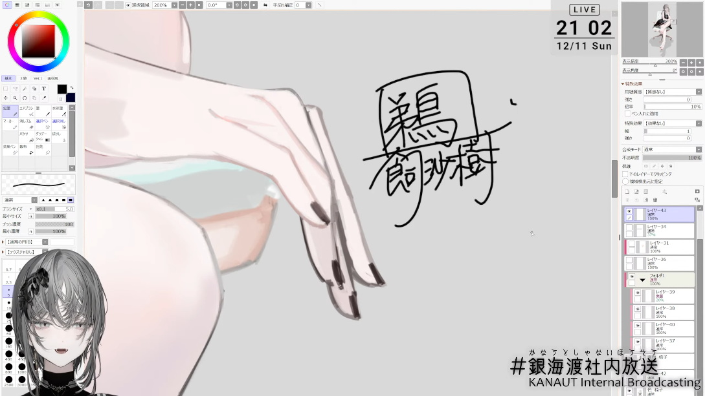

## Fine Art Print

This article is mainly about the signed fine art prints from Ukai Saki (鵜飼沙樹) sensei I missed in the past 3 years.

Partially about Kanaut Nishe's merch.

### "I Think of You Even in My Dreams"

After posting [the previous article](./kanaut-nishe-merch) on my blog, one of my friends sent me a message, asking if I was interested in his collections of Ukai Saki sensei's fine art prints. I said yes, of course, and offered a price for my favorite piece.

And here comes the print I have dreamed of for a long time!

Above is the fine art print produced at the end of 2020 to celebrate the launch of the light novel "[異世界迷宮の最深部を目指そう](https://www.amazon.co.jp/dp/4865548254)" Vol.15. The fascinating part is Ukai-sensei signed on it! But unfortunately, I got occupied by my Master's thesis and the COVID-19 pandemic, so I never had the chance to purchase one.

I cannot describe my gratitude for my friend's willingness to let go of the shiniest gems in his collection.

The digital version is available on [Pixiv](https://www.pixiv.net/artworks/86713438).

From the description [Ukai-sensei wrote on pixiv](https://www.pixiv.net/artworks/86713438), there are some pretty exciting things about the masterpiece.

- This piece is for the new year celebration.
- The hair accessory is a white [Tsubaki](https://en.wikipedia.org/wiki/Toona_sinensis) means _perfect beauty_. Because the entire flower falls when it disperses, it also suggests _death_.
- The patterns on the kimono are [pine, bamboo and plum](https://en.wikipedia.org/wiki/Three_Friends_of_Winter). There are also cranes as part of the traditional design on kimonos for the New Year. But in fact, these are [white egret flowers](https://en.wikipedia.org/wiki/Pecteilis_radiata) disguised as cranes. White egret flower means _I think of you even in my dreams_. Ukai-sensei also used this as the title.

Honestly, I have no idea what this character's name is, and I have never read a single word of the novel. Everything I love is the character design and the illustration itself. But considering how much love Ukai-sensei poured into it, I would consider reading it on Kindle with my poor Japanese.

I also ordered the polishing cloth designed by Ukai-sensei. The design refers to the concept of [Kanaut Airlines](https://twitter.com/ukaisaki/status/1541606179650301953). I love the color and design. It also perfectly fits the role of taking care of Ukai-sensei's precious signed prints.

### "Unholy Orange"

Here's the other fine art print I got in December. I was searching frantically on the Japanese auction sites, but it turned out to be several lying around on the domestic ones.

The digital version is available on [Pixiv](https://www.pixiv.net/artworks/63528913).

It was from the light novel "[異世界拷問姫](https://mfbunkoj.jp/product/goumonhime/321703000340.html)". The illustration was the cover image of Vol.4, and the title was _Unholy Orange_. I was choosing from all nine versions and decided to buy this at first glance.

The character design was elegant and mysterious. It was said that the character was born from the death and last wishes of the departed. According to [the introduction movie](https://www.youtube.com/watch?v=yfZ-kKjtKbU) on KADOKAWA Official Channel, the background was all gravestones. The gravestones had 48 different kinds of designs and were paired with 24 types of flowers. All of these were carefully drawn one after one. Ukai-sensei said it was the most time-consuming illustration of all time.

By the way, I love Ukai-sensei's signature. It's like a traditional name stamp, unlike the more common fancy hand-written cursive design. The signature is pretty easy to recognize, and you can also feel its strength. Because of this, I once thought Ukai-sensei was a male, but I was proven wrong.

Ukai-sensei also talked about her signature in her [last drawing stream in 2022](https://www.youtube.com/live/qUCyKW1WcF8&t=28844), mentioning that signing that on fine art prints and other goods was so tiring. She once planned to switch to a Romaji signature since she hoped the West could recognize her, but the clearly written Kanji signature is already rare enough and easy to remember. She was convinced by the audience and went on with the present one.

## Nishe-chan Pouch

But it would be too stupid to only have one cleaning cloth sent back here. So I bought a pouch having Nishe-chan on it.

The design originates from Ukai-sensei's work named ["時代を着る"](https://twitter.com/ukaisaki/status/1175013512696848384). The illustration was also the first time Kanaut Nishe gained her design.

The pouch was built with high quality and the zip feeling swift when opening and closing. Nishe-chan was also nicely printed. I have been looking forward to having a pouch for my daily use so, this one would be my daily driver.

## Future Plans

The original plan was to buy an A3 print of Ukai Saki sensei's recent works, drawing her original character (OC), Kanaut Nishe. Everything changed right after my friend contacted me.

Being able to collect two signed fine art prints so quickly at a relatively reasonable price is already beyond my wildest dreams. But unfortunately, I have used nearly all the space in my room to hang up the prints. I am planning to move out after my Doctor's graduation. I would definitely spare more place for the prints, but so far, I think I have to pause the purchase.

---

<h3>Camera and Lenses</h3>

- Sony A7R III
- Leica SUMMILUX-M 50mm f/1.4 ASPH (11891)
