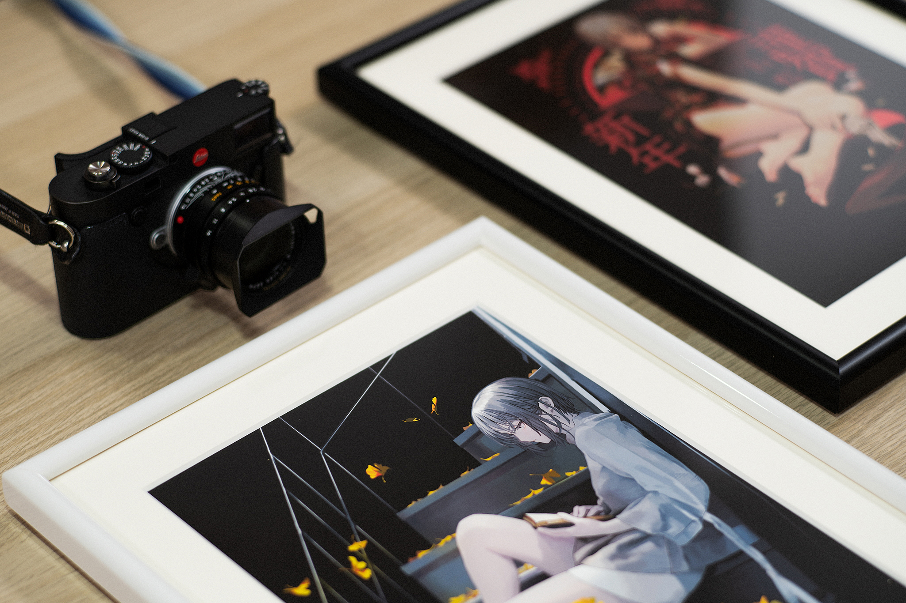
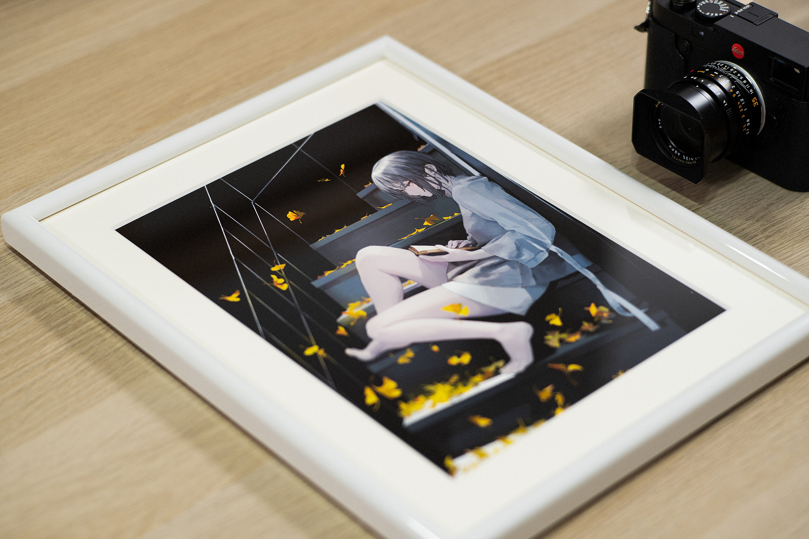
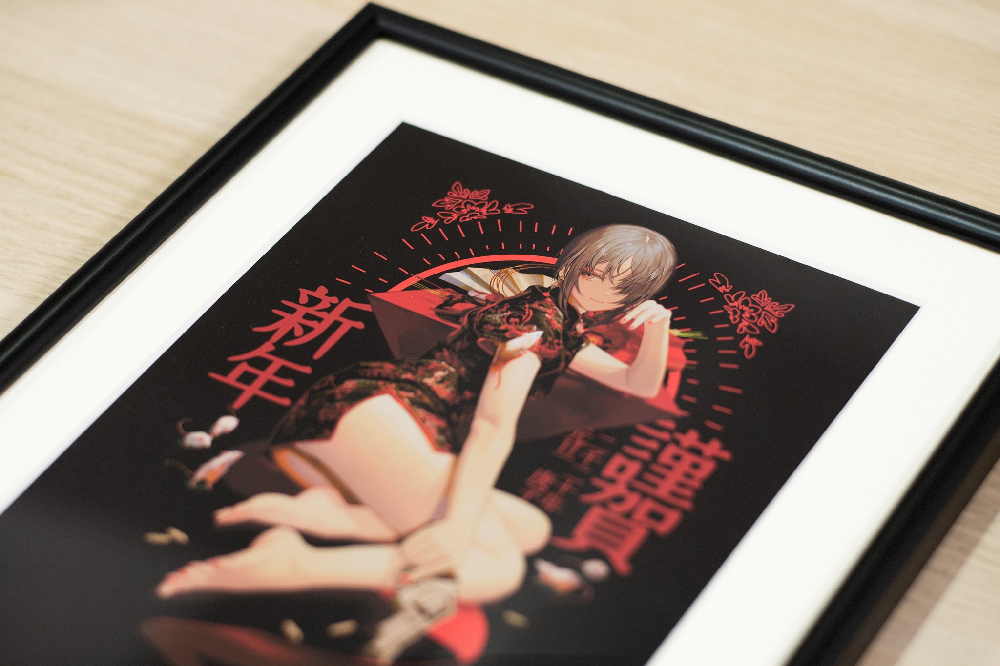
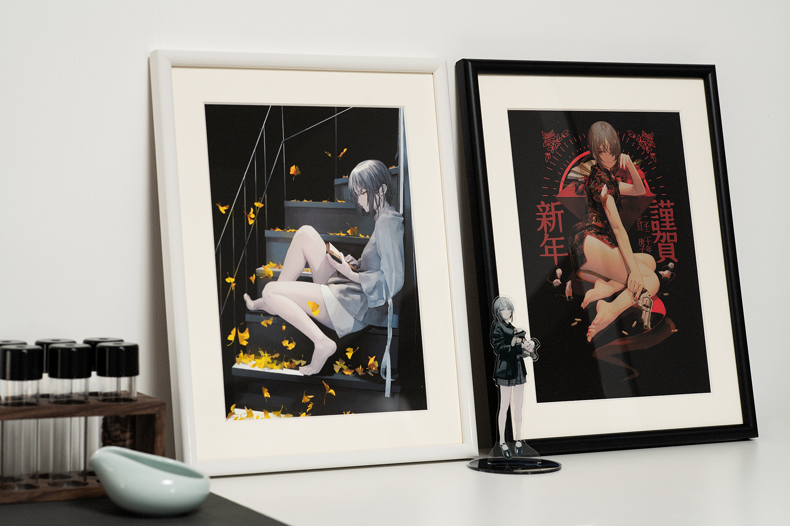
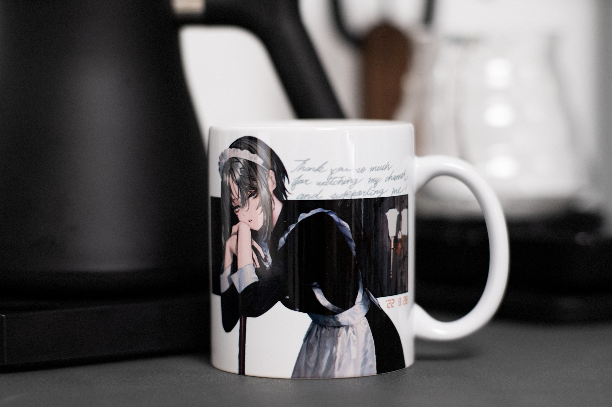
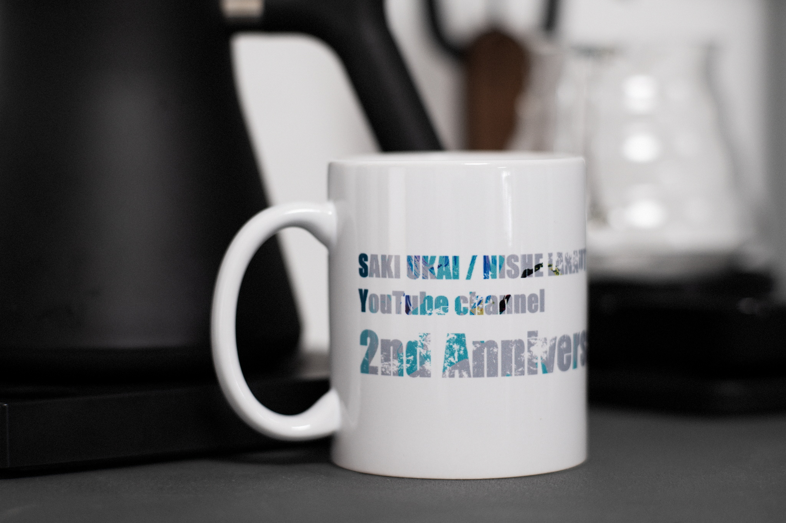
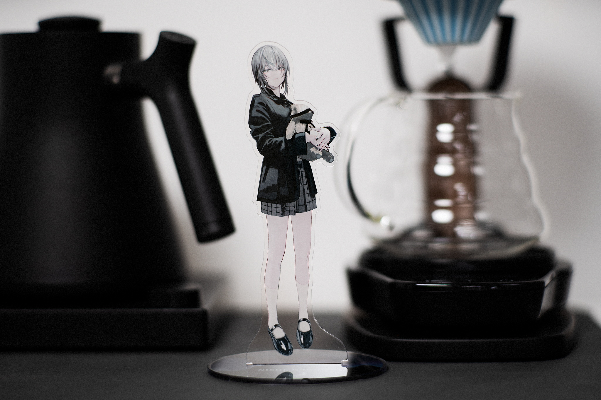
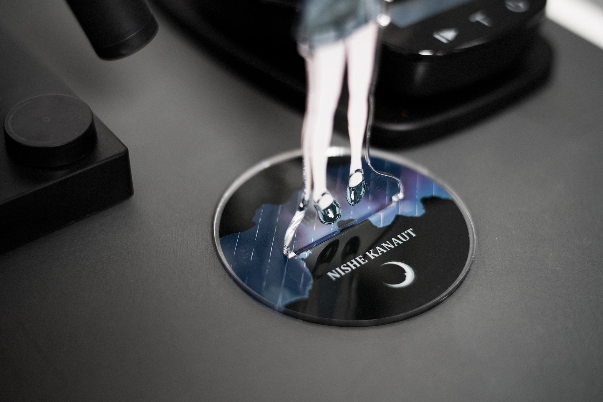

## About Ukai Saki sensei

[ [Twitter](https://twitter.com/ukaisaki) ] [ [YouTube](http://youtube.com/@ukaisaki) ] [ [Booth](https://ukaisaki.booth.pm/) ]

Ukai Saki (鵜飼沙樹) is a Japanese illustrator. She started streaming in 2020 on YouTube. Currently, she streams for 5 hours or longer every Sunday. Her illustrations are famous for being extremely detailed with magnificent character design.

Kanut Nishe (銀海渡ニシェ) is Saki-sensei's original character, also being use as her Live 2D avatar for streaming. Nishe-chan was said to be a vampire and had performed [blood-draining ASMR](https://www.youtube.com/watch?v=iJQABui7d9w).

She has purchased 3Dio FS XLR recently and is currently using it for [her ASMR streams](https://www.youtube.com/watch?v=s1_9TwPd-ts). Her ASMR techniques are pretty impressive by now, even it's just a few months since her first ASMR stream.

## About the merch

I ordered the merch during her [stream on October 2nd](https://www.youtube.com/watch?v=w_UJw5eb7Zo) and just received them on November 8th. EMS is obviously slow recently.

I have ordered

- 2 copies of fine art print
- 1 mug cup
- 1 acrylic figure

Pixiv Factory is doing a pretty good job on presenting very high quality merch but also considerably expensive.

### Fine Art Print

I chose two editions of these. I chose the A4 size over A3 because of limited room space, but I am still planning to buy 1 copy of A3 edition later.

Pixiv Factory might already have experience after holding solo exhibitions for illustrators. The prints are pretty well adjusted, with no visible color issues or wrong color space (e.g., printing the sRGB files in CMYK mode without calibration).

### Mug cup

The mug cup is of regular size, approximately 10cm in height. Ukai-sensei painted the illustration on August 28th’s stream. I certainly love the original picture, and thankfully, Pixiv Factory seemed to be able to preserve the details.

Ah by the way, this is the first edition with the misspell **L**ANAUT instead of **K**ANAUT.

### Acrylic Figure

Honestly, I hesitated before buying this acrylic figure. It was double the regular price of the typical 7-8cm in height. But after reading the description, I found out that this one is 16cm in height, coupled with an extensive, rounded well-designed base. Plus, Ukai-sensei’s illustration, it’s all worth the price!

Again I have to express my gratuities to Pixiv Factory, you guys are doing a magnificent job in producing merch.

---

Camera and Lenses

- Sony A7R III
- Leica APO-Summicron-M 90 f/2 ASPH (11884)
- Leica SUMMILUX-M 50mm f/1.4 ASPH (11891)
