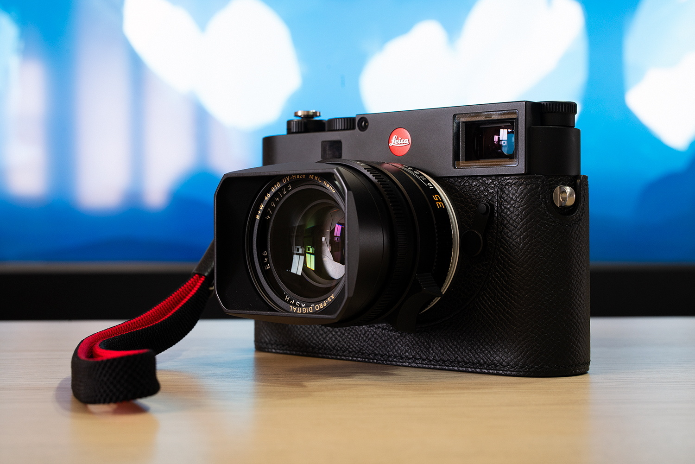
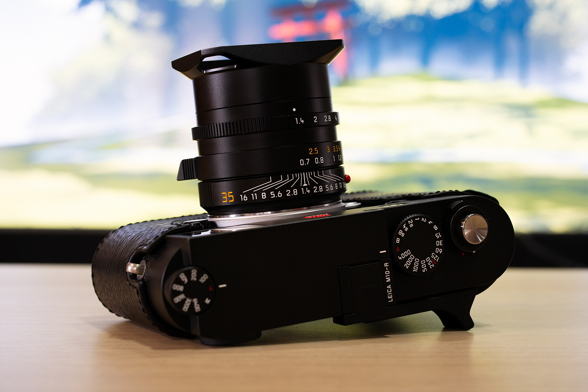

作为“资深”器材党，一直以来徕卡就仿佛遥不可及的梦，久久萦绕在我心头。

这两年由于家母也燃起了摄影之魂，于是变成与家母一起烧摄影器材和拍照了。由于今年疫情原因，国外旅行计划全数取消，自然是多出了非常多资金来购买摄影器材。在我的撺掇之下，家母与我一起出资购买了 LEICA M10-R 和两枚镜头。

- LEICA M10-R Black Chrome Finish
- LEICA SUMMILUX-M 35mm f/1.4 ASPH FLE (11663)
- LEICA SUMMILUX-M 50mm f/1.4 ASPH (11891)
- TECHART LM-EA7
- Artisan & Artist ACAM-313N Professional Silk Hand Strap
- Kontice Order Made EPSOM Leather Case

选择 M10-R 的理由，除了是今年新发售的机身，更新的 CMOS 以及更高的像素都为创作提供了巨大的空间。尤其是不用再特意担心高感问题。尽管个人对那个高调的可乐标不甚满意，但是再那么大创作空间面前便是选择了妥协。

主要考虑到手中还有 A7R3，所以同时购买了天工 LM-EA7 自动对焦环以将 M 头转接至 A7R3 上。当然不得不说这也是一个国产黑科技，不大的接环实现了 M 头的自动对焦，甚至可以通过二次转接盘活更多型号的老旧手动对焦头。

而 11663 和 11891 自不必多说。徕卡的 35mm、50mm 是各种意义上的看家焦段，而这两枚现行版镜头也是拥有着极佳素质。之前曾经考虑过是否要去淘一支 11874 双非，不过最后在“买新不买旧”的原则面前败退下来了。而 11891 拿到后立刻转接至 A7m3 上拍摄了上面这张照片。尽管 100%放大后，11891 的 16 岁高龄的光学设计已然难以喂饱 A7R3 和 M10-R 这两块 4000 万级别的 CMOS，但是这又何妨呢？稍微缩一缩图，这画面依然油润又不失锐利。

在背带方面纠结了很久，一方面是在 AA 真丝系列高昂的价格面前略有迟疑，另一方面，手中仿制 AA 的登山绳背带在 M10-R 的实际使用中只让我觉得碍事。于是最后选定了 ACAM-313N 这根真丝腕带，一方面不破坏原有握持感，另一方面也是因为它较为年轻的红黑配色，非常有特色。

皮套来自于 Kontice Leather。由于是黑色机身，填写定制订单时便想着要保持低调，所以面料选择了 EPSOM 掌纹，并且要求制成底部可换电池的版本。皮套到手后便感受到了与普通皮料截然不同的手感和做工，确实非常对得起它高昂的价格，并且与机身浑然天成。
