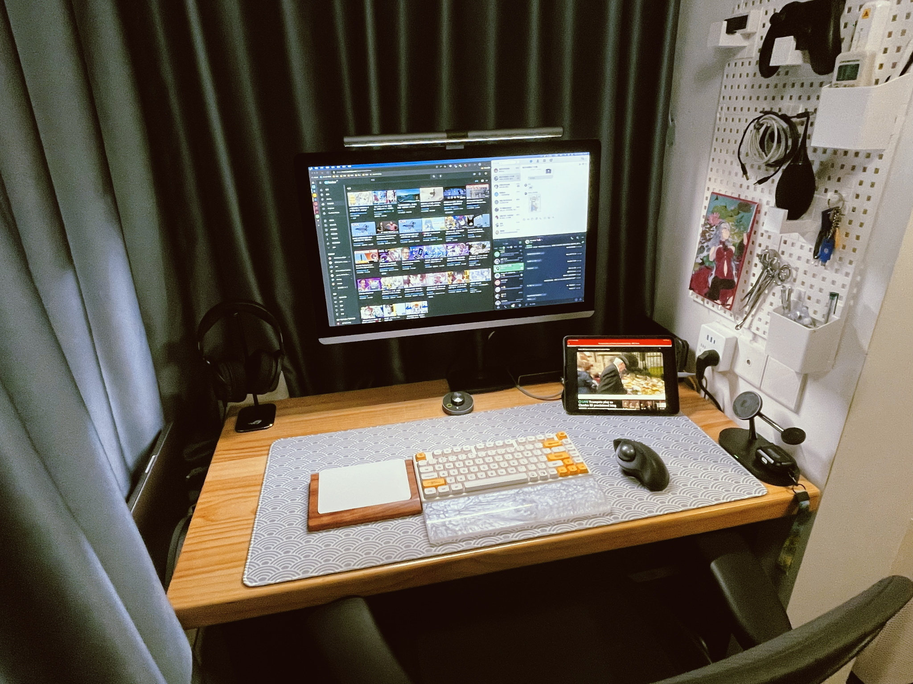

## 动机

2022 年上海因“抗疫”行动封城前非常幸运地拿到了我的 Macbook Pro 14"，不幸的是本来想补上 AppleCare+ 却因为封楼封城错过了时间窗，只能作罢，自己小心用。

当时因为物流完全不通，周边设备都完全没办法购买或更新，只能用原先 Windows 机器时的显示器和音响过活。当时摆了个上面 27 寸大屏，下面 Macbook Pro 展开用的结构（实际上不怎么好看就没拍照）。封城期间看看电影和聊天倒没什么问题，但到后续工作重新开展，以及这两个月开始要书写并投稿论文、伏案工作时间延长，这问题就逐渐凸显了——趴在那边看笔记本脖子和眼睛都实在太难受了。

于是等待封城结束、物流恢复之后，就开始了桌面大改造。

## 设备列表

|      设备      |             Before              |         After          |
| :------------: | :-----------------------------: | :--------------------: |
|   人体工学椅   |        Ergomax Commander        | Herman Miller Aeron 2  |
|     显示器     |           淘宝 DIY 5K           |  无变化，调整接线方案  |
|   显示器支架   |     自带仿 Apple 风格铝合金     |     Ergotron LX45      |
|      音响      | PreSonus Eris E3.5 （二手战斗） |     GENELEC G One      |
|      前级      |               N/A               |    矩声 Mini-i Pro3    |
|     扩展坞     |               N/A               |  Zikko TBT4 Full Dock  |
|    外接存储    |           Orico USB4            |     WERO TB3+USB4      |
|    外接 SSD    |           WD SN550 1T           |      WD SN750 1T       |
|      NAS       |        J3455 组装黑群晖         |      白裙 DS1821+      |
| Magsafe 充电器 |            淘宝杂牌             |     少数派 点金石      |
|    游戏耳机    |               N/A               |      ROG Delta S       |
|      鼠标      |          Logi Ergo MX           | （新增）Magic Trackpad |

吐槽一下，我的桌面因为装修规格是 19 年前的（也就是 2003 年，我小学三年级的时候，我现在博士三年级了）所以只有 110cm，大把设备放不下，或者要定做从而导致价格相当高。至于为什么迟迟没有大装修，这就是另一个话题了。

此外还花了不少钱在接线上…由于显示器的 Type-C 接口比一般的要深，需要加长接口才能刚好连通。而市面上大部分线材都没有做加长，当时商家送的线材又经不起插拔断头了，只能在淘宝上找了一家定做雷电线的店家。结果发现完全可以搞定，又觉得挺好看，于是就…把所有在外边的接线都换成定制版的了（就是好贵，一根起码 300 多）。

还有一个比较昂贵的就是前级连接两只真力 G1 的 RCA 线，买了欧亚德的 [TUNAMI TERZO RR V2](http://www.oyaide.com/ja/products/audio_cable/interconnect_cable_rca/tunami_terzo_rr_v2)，一对 2k 多…以前玩 HiFi 的时候怎么没觉得那么贵！？

## 照片

### Version 1.1

这是刚整理完时的 1.1 版本。当时还没有感知到音长时间佩戴耳机给脖子带来的不适，于是桌面上没有保留音响相关的设备。

右手边的洞洞板其实也是先于整个桌面整理开始的，后来随着桌面改造的进度一直在重新编排。

1.1 版本只是对显示器支架进行了更换，Ergotron 支架让整个屏幕向后再空出了数公分的空间，对于我这个寸土寸金的桌面而言，不仅让出了更大的光照范围，也明显减少了屏幕带来的压迫感。另外 Ergotron 的支架真的好，以往用过两个悬臂支架，都是乐 X 等国产品牌，无论阻尼还是做工都差远了。当时被沉头、旋转阻尼不均匀无法保持水平等问题折磨了很久。

另外也有朋友问我为什么要左手 Magic Trackpad，右手轨迹球。呃…怎么说呢，有两个原因。其一是因为我在单位也是操作轨迹球和摇杆较多，轨迹球手感比起鼠标要熟悉得多。其二是因为桌子面积实在太小，鼠标也甩不开。

而 Magic Trackpad 也有它自己的问题导致我没办法只使用它。其一是它的蓝牙还是可怜巴巴的 3.0，其二是毕竟屏幕是 60Hz 的，比起 120Hz 的 Macbook Pro 原装屏+原装 Trackpad 操作而言…总感觉操作不太跟手，为了不要操作感觉太过割裂，最后还只是留在左手侧作为手势操作用的设备。哦对了， Macbook Pro 的蓝牙似乎仍有明显的祖传问题，连接设备一多就会导致卡顿、断流，本想一个蓝牙解决全部问题的我，最后还是被迫键盘用键盘的接收器、鼠标用鼠标的。如果不是讨厌桌上太多线，我肯定会有线连接 Magic Trackpad。

### Version 1.2

~~对不起大调整前忘记拍照了~~

1.2 版本相较于 1.1 版本主要改动是增加了两侧的真力 G1。由于桌面尺寸小，以及桌面音箱选择实际上并不多，加上视听后迅速排除了其他品牌的音箱…我最后还是老老实实掏钱上了 G1。尽管也有认为 G1 是 3 寸，天生残废，等等的人士在，但它作为桌面 HiFi 设备，能力也有隔壁书房的书架箱系统的五成了（那边还花了大价钱买了相关避震器材），我已经相当满足。

原先店家送了定做的 RCA 转 3.5mm 线，我也想是利用 MacBook Pro 此次据说升级到非常 Pro 的 3.5mm 音频口。但试了几天后发现，插拔实在太不方便。本身 Macbook Pro 我的放置位置就是利用了窗檐，雷电线的插拔就有点麻烦，现在还要多插一根 3.5mm 线。而这 3.5mm 线要是插在 Dock 上就会平白无故多一根巨丑的线还不能保证音质…呃，怎么办呢。

后来查了查目前比较流行、价格可以接受的 G1 搭配，就发现了矩声 Mini-i Pro3。这台前级主打就是连接有源音箱，而且体积相较于传统 HiFi 设备而言可以说是极其小巧了。输入规格等也支持得很完整，做了几天功课后就拿下了。

但比较遗憾的是欧亚德的 RCA 线，拿到手后发现是无比粗大。两只 G1 本身因为我的座位高度原因需要抬头 15 度，这线安装好后连平放都有困难。只能默默先拆下，思考怎么解决。

看了淘宝几家后发现支架普遍都只有黑色，只有原装的有白色支架，由于我并不喜欢黑白配，就只得忍痛购买原厂巨贵无比支架了。

### Version 1.3

书接 1.2 的时候发现的问题。信号线太粗以及弯折不了太大角度导致整个桌面再次重整。

首先是调整了显示器的高度，将高度整个降下来，以减少抬头及向上看的时间（预防干眼）。但这就压缩了 TBT4 扩展坞可用的区域。于是我将整个扩展坞用 3M 胶粘在了桌子底下，所有接线一并从桌下走，实际上让桌面上走线更少了，舒服。但是扩展坞在扔到桌面下之后出现了较为严重的发热。

推测可能原因是

- 桌底通风相对较差，空气对流较少，较难带走热量（桌面上还有空调的风可以吹到）
- 新增 DAC 需要通过 USB 连接并持续传输音频数据，播放 NAS 上的 DSD 文件时还有网卡的参与，发热量随着负载上升增加
- 硬件错误或 MacBook 的 bug（不太可能，但不能除外，需要观察）

不过解决方法倒也简单，其实把之前闲置的半导体散热器放上就行，但我发现半导体散热器的风扇声音会随着桌面扩散，于是只能作罢，直接在淘宝上买了一块原本给路由器散热用的铝块贴上…倒也解决了大部分问题。

随后是因为显示器高度降低，中轴位置变化，而将 DAC 放在左侧，整个桌面又显得极其拥挤，甚至会将 DAC 放在路由器前，存在严重干扰机内信号的风险。我就把中轴和悬臂的方向换了一下，就是现在这样了。显示器下空了大量空间，正好可以放下一台 DAC。整个桌面也较为平衡。尤其扩展坞挪到桌面下，设备层叠带来的拥挤感和压迫感不复存在。

关于真力 G1 的支架选择，之前看过淘宝，有 100 来块出头的国产替用支架，但是实在是难看，并且只有黑色，与白色明显不搭，于是只能忍痛购买原厂单只高达 419 人民币的 Made in Germany 的支架…但，贵归贵，搭是真的搭，而且做工相当扎实，不晃动，对于异常共振的消除也做得很好，只能说贵还是有贵的理由。

这次能把桌面收拾到这么干净，还有一个原因就是把所有的零碎物件都扔进了抽屉以及上了墙。

淘宝找了一家洞洞板就装了，基本把平时要用的手柄、耳机、充电线、笔、遥控器等都放了上去。

Switch 当时想过是不是要整个底座一起放上去，但发现占地空间相当大，而且存在和音箱冲突的风险。搜寻了一下淘宝发现，有充电底座可以做到充电、外接 USB 设备、HDMI 接屏幕的操作。品牌就不具体推荐了（一搜就有），不过这着实是直击痛点。我当时就决定把底座拆掉，闲置的 USB4 全功能线拿出来，插上。并且在洞洞板上挂上钩子，并且做了一个侧边防护（防掉）。后续测试 HDMI 连接屏幕也是一次点亮，成功减负！

### Version 1.4

现阶段的最终版本。

因为一些原因出掉了手里旧款 BENQ 屏幕灯，并且换了最新的无线控制器款，也就是 BENQ Screenbar Halo。这款最大的惊喜就在于“自动档”是真的自动的——传感器从控制器上移动到了灯上，并且会实时随着环境光变化自动调整。

这下不用再把烦人的控制器放在光照下，同时还有了屏幕后的背光照亮环境。

满足！

## 对比与总结

我终于从之前的聊天记录里翻出来了一张 ver 0.1 的图，现在回想一下我怎么忍耐下来这么乱的一个桌面的，简直不可思议（当然封城客观上也阻止了我进行任何形式的折腾）。顺带感叹一下只要肯利用好桌底空间和墙面，桌面上真的可以做到干干净净…

前后大概折腾了一个月，开销也是…自己都快不敢算的程度。但比起一个能快快乐乐有好心情干活的桌面，这点开销又能算什么呢（x

另外一个小预告：Mini-i Pro 3 和真力 G1 的折腾和听感报告会在后续一篇里写到。真力 G1 对我来说是第一对正儿八经的有源箱，而且它的表现让我非常震撼。我不喜欢写什么听感或者相关非常主观的东西，最多随便说几句，主要还是在一些选择和折腾方面的感想。
