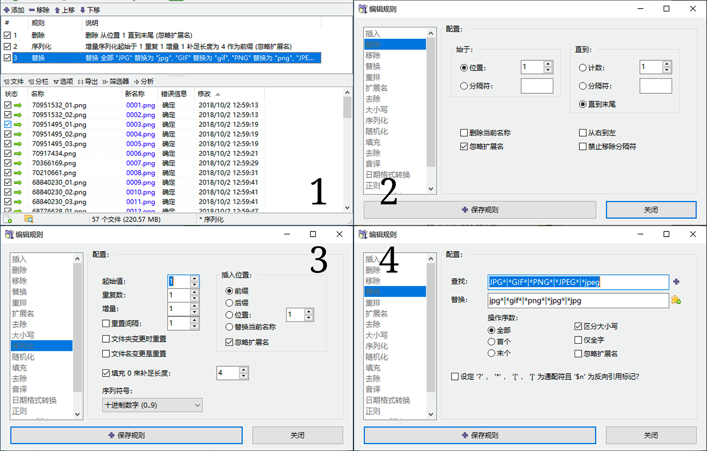

**WARNING！本文部分内容建议 18 岁以上阅读。**

上个月把自己的本地图库给重构了一次，稍微缓解了某些文件夹乱如`node_modules`的处境让色图整理变得伟大！

## 发现问题

事情的起因其实是根据 Pockies 的教程将自己的视频库爱情动作片库进行了一次整理，并且搭建起了基于群晖的 Plex 视频库。

感兴趣的读者可以 **[点击这里](https://pockies.github.io/2020/01/09/av-data-capture-jellyfin-kodi/)** 学习如何整理。


然而当我点开放置 Pixiv Downloader 批量拖下来的图片库时…我就感到不适。


由于整个图库文件夹实在过于积重难返，加上出现了用 Resilo Sync 在多台电脑之间选择性同步的需求，遂下定决心将图库文件夹进行一次重构。

## 提出假设

### 通过 tags 分类？

目前互联网上最优秀的图库应当属于 Booru 站点，作为代表的当然是 Danbooru 以及 Yande.re。

Booru 站点的优势在于拥有强大的`tags`功能，不仅可以对图片的作者进行标记，且可以通过大量用户编辑的`tags`对~~性癖~~进行分类。

原先的构想也是基于`tags`，以作者为文件夹单位，进行图库的整理。但是发现`tags`的交叉太多，并且不可能一张张手动进行标记。此外也不想把一张图片复制到多个文件夹下（这和`node_modules`有什么区别）。

如果说能把 Plex 的优点（服务端获取额外刮削信息并展示）和 Booru 的优点（大量`tags`信息）结合起来就好了，但我不会写爬虫。此外还有一个难点：如何让本地图片和云端对应起来？图片可能来源于 Twitter、Pixiv、fanbox、patreon 等等网站，甚至是其他 booru 图站；极端情况下文件名丢失，对应难度直线上升。

基于以上理由，暂不考虑`tags`分类法。

### 仅以作者进行分类？

这个其实是最暴力的方式。因为我本地部署了`Listary`和`Everything`进行索引和搜素服务，所以仅仅对作者进行搜索是不成问题了。

但是在开篇就已经说过了，Pixiv Downloader 下载堆积出来的混乱文件夹令我只有把文件夹关掉的冲动，所以否决。

最大的问题还是在于图片的数量和来源非常杂乱，不像爱情动作片可以从 DMM.co.jp 等站点拉取标准化的信息并进行分类。

### 应用软件？

备选方案有 Eagle 和 Lightroom，以及本地看图的 XnView。

这些软件均拥有类似于`tags`的功能，但是前者很“重”，而且是付费软件，尽管我有 Lightroom 的订阅，但因其不能兼顾移动端而放弃。XnView 更不必说了，同样是不能兼容移动端，所以最后决定细化文件夹结构以解决部分问题、满足需求。

## 解决问题

那么最终怎么解决呢？我选择了并轨制。

事先说明：这是一个基于主观判断的整理方式，并不一定适合所有人。

### 最终的文件夹结构

尽管分类和分层变多了，但尽可能结合了`tags`的便捷，并最大程度利用了 Pixiv Downloader 的文件结构有助于检索。

```ini
图库
│
│
├────图片
│       │
│       ├────Artist
│       │       ├───Paid Contents #故名思义
│       │       │      ├────xxx
│       │       │      │       └──xxx_fanbox #添加来源
│       │       │      └────yyy #下略
│       │       │
│       │       ├───★★★★★ #根据星级分层
│       │       ├───★★★★
│       │       ├───★★★
│       │       └───Unsorted #用作批量下载的缓冲区，尽快解决吧…
│       │
│       ├────Fetish #故名思义
│       │       ├───xxx
│       │       └───yyy
│       │
│       ├────Title #根据不同的作品（游戏、动画等安放）
│       │       ├───xxx
│       │       └───yyy
│       │
│       ├────Vtuber #根据不同的Vtuber进行分类
│       │       ├───xxx
│       │       │      └──xxx_R18 #便于检索，下略
│       │       └───yyy
│       │
│       └────Unsorted #总有些无处安放的图
│
├────照片 #自己拍摄的照片
│       ├───人像
│       ├───风景
│       └───其他
│
└────壁纸
        ├───5K Wallpapers
        ├───2K Wallpapers
        └───iPhone Wallpapers
```

### Aritist 文件夹

主要形式是`"userName" ("pixivID")`的形式，例如`米山舞 (1554775)`，这一部分可手动创建，或通过 Pixiv Downloader 进行定义。

我的 Pixiv Download 参数设定如下

```sh
PxDownloader/${userName} (${userId})/${id}_p0 #单一档案用
PxDownloader/${userName} (${userId})/${id}_p${page} #复数档案
```

### 将部分文件夹内文件名序列化

主要是 Paid Contents 这一部分来源非常乱：

- Patreon 上部分作者会提供当期奖励打包，但很多需要自己右键保存

- fanbox 的图片命名是无序的，直接下载后放入图库会出现非常大的混乱

- 有些时候连`jpg`文件后缀也是`jpeg`，强迫症非常不适

这么多问题，一个个手动就很蛋疼。于是我采用了`ReNamer`，进行批量序列化的操作。



1.程序界面与结果预览；2.删除扩展名以外的文件名；

3.序列化并补足四位数；4.将所有的扩展名统一。

最后可以获得`0001.jpg`起的令人舒适的文件夹内容。

## 问题解决了吗？

问题解决了一部分

1. 细化文件夹结构，在直接文件夹内浏览时以少许速度为牺牲，提升了准确度

2. 解决了 Unsorted 缓冲区堆积过多却不知道向哪里分流的问题

3. 对于`Listary`以及`Everything`的影响较少

没有解决的问题：**针对文件直接添加**`tags`。

还是如同前文所说，`tags`尽管可以最大程度细化分类、精准搜索图片，但是需要大量编辑人员进行添加，个人用户不可能做到这么精细。

另外，基于`tags`的文件浏览器的缺乏，以及数据共通的难度。e.g. XnView 尽管拥有类似`tags`的系统，但是无法和 iOS 进行数据共通。

所以最后放弃了`tags`分类的想法。

## 总结

重构图库的结果是并轨制，以少量文件夹浏览速度为牺牲，提升了准确度。

如果有能够结合 Booru 和 Plex 的优秀的`tags`管理方法，请务必告诉我。
