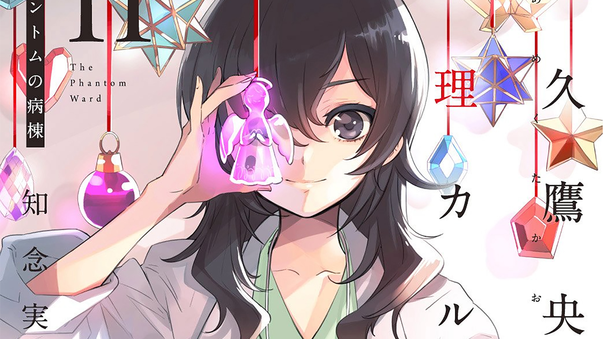

注意：**本文含有剧透**

手里这套医疗推理小说是[新潮文库 nex 推出的「天久鷹央」系列](https://www.shinchobunko-nex.jp/special/180027.html)（天久鷹央の推理カルテ、天久鷹央の事件カルテ），目前共计 10 册，我目前读到第 3 册。作者是[知念実希人](https://www.wikiwand.com/ja/知念実希人)，毕业于東京慈恵会医科大学，本业是一名内科医生。虽然平时一直说看病就像是在探案：层层抽丝剥茧、寻找证据、最后抓出病源、得出诊断，但是一直苦于没有相应的文笔和精力将自己的经历写成小说。加之这套小说的封绘由[いとうのいぢ（伊东杂音）](https://www.wikiwand.com/ja/いとうのいぢ)老师绘制，作为十来年前就看伊东老师插画/人设长大的老腊肉，自然是不愿意错过这套小说的。

就前两册而言，自己作为一名内科医生，确实体会到了与“侦探”斗智的快乐。尽管不像在临床上那样，可以亲眼看病人、问病史、读病历、看化验、做查体、请会诊等等，内科医生出身的作者还是将大部分需要告知读者的点写了出来，并在大部分的故事中可以推导得出诊断。这是一种比较新奇的体验，除开平日工作中一直在经历的缜密探索，第一次体验了“从文字间拼凑还原事实并理出真相”的感觉。应该还是得益于作者本身就是医生的缘故，对于诊疗情节的刻画、信息的排布掌握得不错，并且释放了不少烟雾弹，反而会对医疗专业读者形成迷惑。

最有成就感的一部分是第一册的最后一个故事「オーダーメイドの毒薬」。这个故事中，不仅与前几章寥寥几句话带过的一眼诊断出的维生素 A 过量串起来，并且最后的谜题也非常的难。卡马西平与西柚的致命组合尽管被我思索后迅速看破，但如果没有相应的用药经验，没有看过药品说明书或做过相关研究，根本无从知晓这是一个强力的 **CYP3A4 抑制剂**，进而引发故事中的情节。

稍有可惜的地方，就是有些病例太过简单了。例如第二册的第一个故事「甘い毒」，开篇就看得出患者体型肥胖、嗜糖，并且可以总结出明确的 **Whipple 三联征**，也就是可以基本诊断胰岛细胞瘤。所以对于医疗专业读者来说，小说的故事有时却又未免太简单了点。因此我也比较好奇，这些故事对于非医学专业读者来说，又是怎么读、怎么思考的呢？

此外，也有非常想吐槽的、关于专业性地方。其一，第一册的第三个故事「不可視の胎児」就明显没有好好做查体，患者腹痛来诊竟然没有做腹部查体，到最后才想起来做 B 超时似乎有异常腹膜刺激征，并拖到了宫外孕大出血抢救及紧急手术，如果这是在国内，早就因为误诊、漏诊，构成医疗事故并上法庭了。其二，第二册最后一个故事，尽管非常感人，但是情节和编排仍然较为牵强。除了缺少病房平面图，无从知晓病房间的空间关系，最后的谜底竟然是患儿偷摸进护士台偷取三磷酸腺苷二钠（ATP）这样的高危药品！高危药品根据国内规定，有严格的保存、使用前后查对及存量清点流程，怎可是这么一个重大事故！尽管明白小说需要夸大一些情节、制造一些意外，但小说中的一些细节，还是让我对日本的医疗专业性和制度，产生了些许怀疑……不知道现实中的日本医院，是否也是这么的不专业？

总而言之，本小说目前至第二册可以打 7/10 分，不知道近两年的作品是否会更缜密和有趣？读完后会继续更新。
