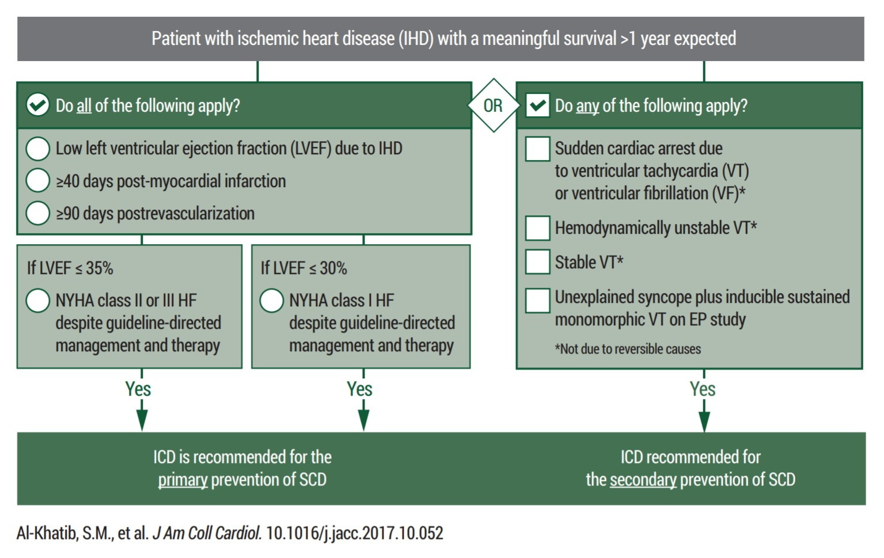
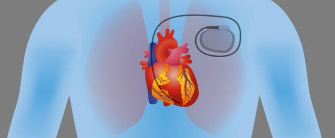
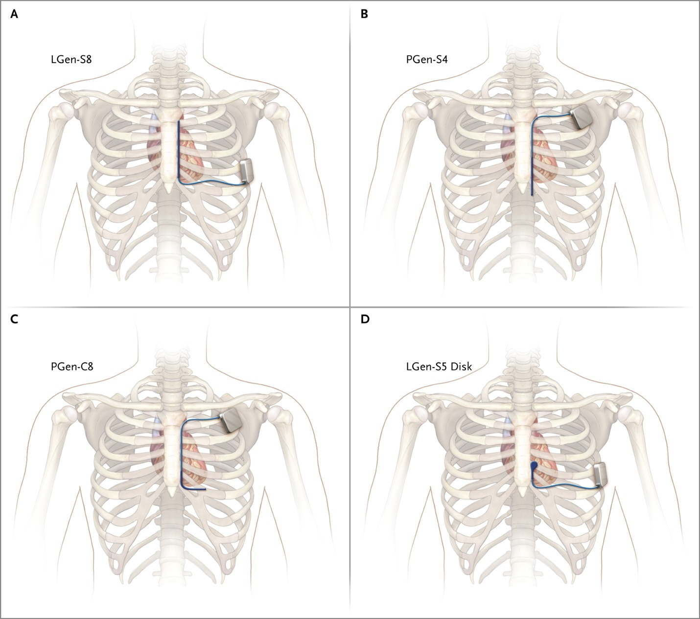
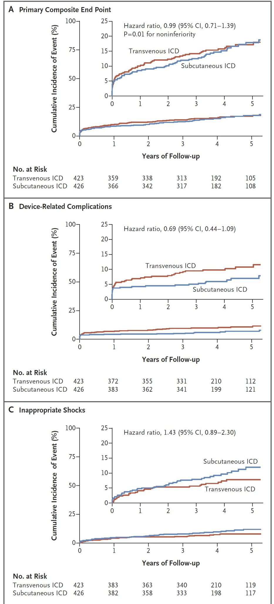
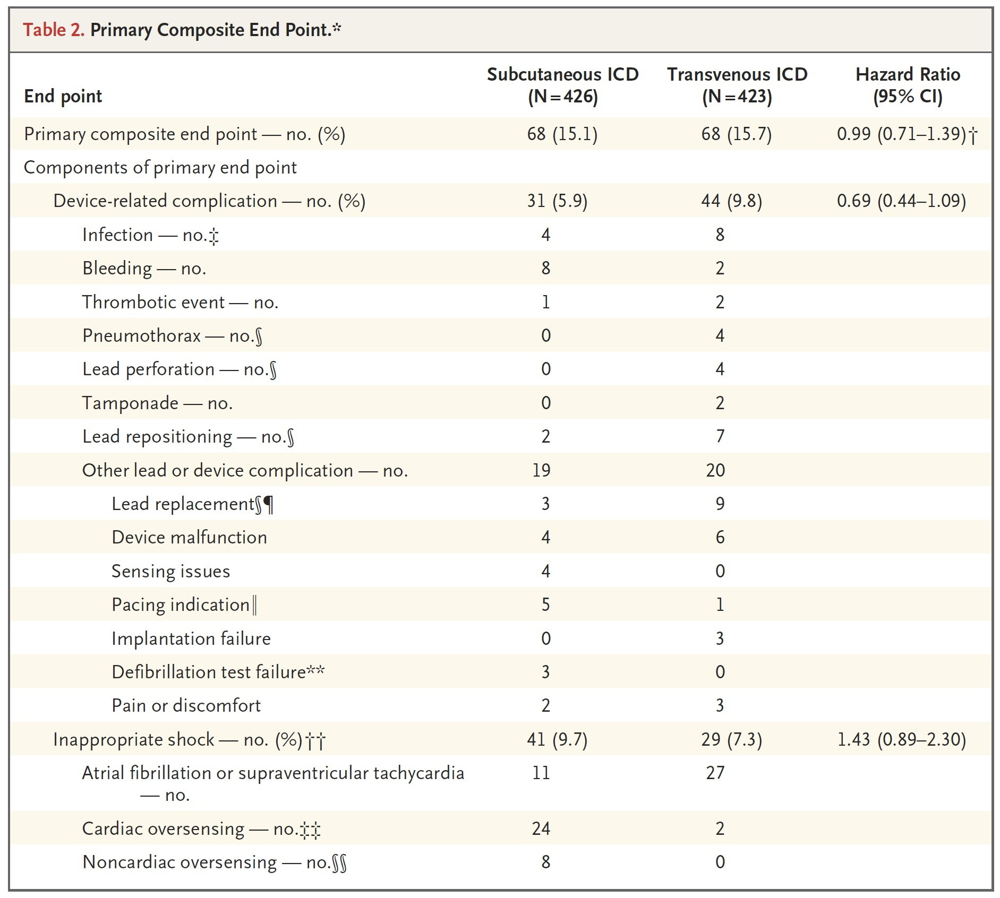

轮转期间其实收了不少无明显诱因的室颤病人，并在排除相关可逆性原因后选择植入 ICD；同样，我也非常关注 S-ICD 的发展。

今天在 NEJM 上读到最新的 S-ICD 及 ICD 疗效评价，故记录下来。

---

文献标题：**Subcutaneous or Transvenous Defibrillator Therapy**

[文献地址](https://www.nejm.org/doi/full/10.1056/NEJMoa1915932)

---

首先复习一下 ICD 的植入指征[^1]：

根据上图可知，主要植入 ICD 的患者包括冠状动脉疾病（CAD, coronary artery disease）[^2]合并有左室射血分数下降（LVEF, left ventricular ejection fraction）的患者、心源性猝死（VT、VF）生还者。

而目前常用的 ICD 为经静脉植入型号，如 Medtronic EVERA™ ICD 等。经静脉植入的 ICD，主机位于胸前区、锁骨下方 2cm 左右的皮下囊袋内，导线入路通常为锁骨下静脉或头静脉[^3]。

这一入路技术开展多年，血管穿刺非常成熟，但是面临着术后感染、感染性心内膜炎、心脏瓣膜赘生物等术后并发症；严重时该并发症可致心肌穿孔或患者死亡，或是导致导线失效，进而在 VT/VF 时不能识别及除颤[^1]。

Boston Scientific 在 2010 年推出了全皮下植入 ICD[^4]，这一 ICD 的优势在于它的创面更小，且全部位于皮下，不进入静脉，显著降低了血管穿刺并发症、全身血流感染风险以及严重的心脏并发症（心肌穿孔、心包填塞）等等。

但是，由于传统的经静脉 ICD 是直接向心肌释放除颤能量，因此可能具有更好的 VT/VF 识别率，以及更低的除颤能量，因此 S-ICD 一直以来备受质疑。

---

这篇文献中的研究则是一项非劣效性研究，旨在明确 S-ICD 是否非劣效于传统 ICD。该项目基于 PRAETORIAN 研究，共纳入了 876 名患者。这些患者根据指南均具有 I 或 IIa 类植入 ICD 指征用以一级或二级预防。排除标准包括既往 ICD 植入史、合并有其他心动过缓并需要植入单腔/双腔起搏器、心室率小于 170 次/分的室速、药物和消融难治的复发性单形性室性心动过速。研究中共有 442 名患者植入 S-ICD、434 名患者经静脉植入 ICD，并在植入后进行 4 个月的随访，并在之后每年至少随访 2 次。

主要终点事件：

1. 植入物相关的并发症
   1. 植入物失效致移除主机及导线
   2. 需要引流、输血、延长住院天数的囊袋血肿
   3. 植入物相关的栓塞事件
   4. 需介入手术并延长住院天数的气胸或血胸
   5. 心脏穿孔或填塞
   6. 导线重新放置或更换
   7. 其他需手术或药物介入治疗的与导线或主机相关的问题
2. 不恰当放电

次要终点事件：

1. 包括主要终点的各个部分
2. 任何原因导致的死亡
3. 恰当的放电（包括 ATP）
4. 主要不良心脏事件（Major adverse cardiac events, MACE）
5. 因心衰住院
6. 分配设备交叉

研究结果大体上可以认为 S-ICD 非劣效于 ICD，因为在主要终点事件的发生数量相当，植入装置相关的并发症更少。

但是也必须指出相应的问题：

1. S-ICD 的不恰当放电次高于 ICD：可能与 T 波和 P 波过感知，以及心室率感知阈下房颤/室上速相关
2. S-ICD 的 ATP（Antitachycardia Pacing）功能以及感知功能较 ICD 薄弱，难以通过 ATP 终止 VT，进而造成放电次数增加或不恰当放电

由此可见，尽管 S-ICD 的总体治疗效果不亚于 ICD 且植入物相关并发症更少，但是功能实现存在难度，以及程控细节上较传统 ICD 要求更高；要进入临床大规模应用甚至替代传统 ICD 还有很长的路要走。

[^1]: Al-Khatib S M, Stevenson W G, Ackerman M J, et al. 2017 AHA/ACC/HRS guideline for management of patients with ventricular arrhythmias and the prevention of sudden cardiac death: a report of the American College of Cardiology/American Heart Association Task Force on Clinical Practice Guidelines and the Heart Rhythm Society[J]. Journal of the American College of Cardiology, 2018, 72(14): e91-e220.
[^2]: 文中 IHD 指缺血性心脏病（ischemic heart disease），与 CAD 同义。
[^3]: 防疫·关心 | 一份来自吴立群教授关于心脏起搏器的问答清单：[链接](https://www.drvoice.cn/article/5507)
[^4]: Bardy G H, Smith W M, Hood M A, et al. An entirely subcutaneous implantable cardioverter–defibrillator[J]. New England Journal of Medicine, 2010, 363(1): 36-44.
