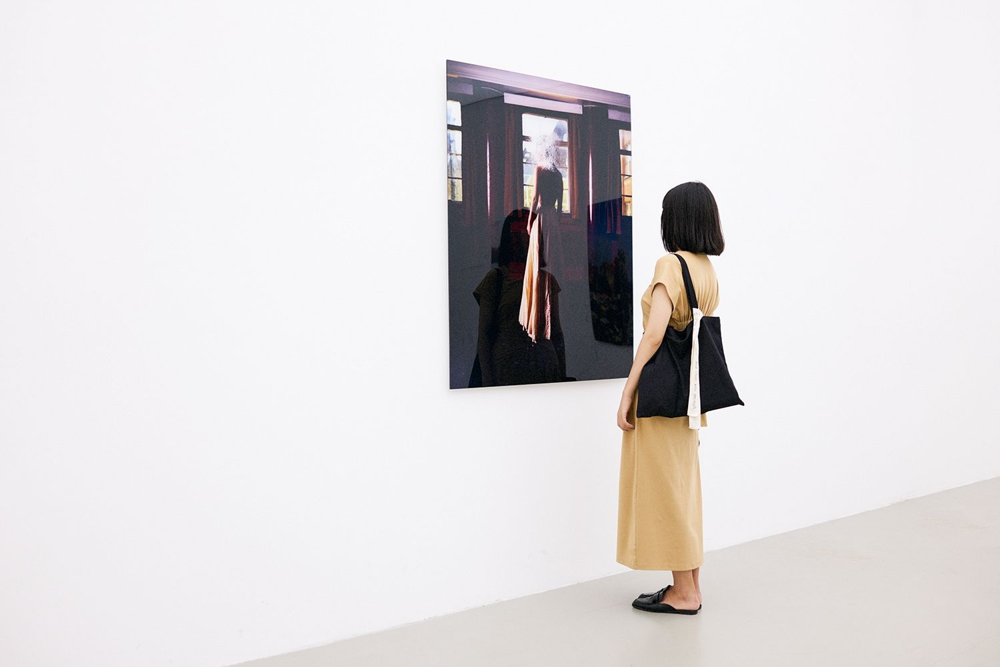

虽然说昨天就已经顺利建立了 Hexo + NexT 的博客，并且好不容易动手写完了久违的一篇博客，并且想写下一点点迷思。

## 折腾

先说折腾吧。因为先前看到了 Github Pages 可以托管博客，于是在各种因素之下动心，然后间断拖了半个月把博客搭起来了。

一开始选择的 Hexo，并且选了最大路的 NexT 主题（功能相当完善），不过在 nodejs 那巨大的 modules 面前非常头疼。查了资料后决定转投 Hugo，并且在[reuixiy 大佬](https://io-oi.me/)的博客发现了 MemE 这款主题（[github 项目地址](https://github.com/reuixiy/hugo-theme-meme)），觉得 Hugo 轻量化且主题具备我所需要的功能，便在老马的指导下再次折腾了一下午。

于是新的博客就这么建好了。

08-05 22:40 更新：由于 Hugo 的奇怪 Bug，导致部署后出现各种奇怪的 css 相关问题，且排查起来毫无头绪，遂决定暂时滚回到 Hexo 方案。

08-08 16:30 更新：通过 WSL2 解决了 Hugo 的部署问题，记录了一下相关踩坑记录。

## 博客迷思

其实很久以前就用过博客（fc2、Wordpress、新浪博客 etc.），后来也经营过 Lofter，不过除了 Lofter 以外都不算长久。fc2 和 Wordpress 先后被墙，曾经用 GoAgent、红杏等等想办法上去，但是最终因为线路问题难以为继。此外当时是高中，很难有时间持续写博客。即便是大学后开始经营的 Lofter 也遇到了很多麻烦。最初 Lofter 在 Evan 设想下是作为高品位的摄影社区推出的，后来因为 Evan 调走，新的社区运营把 Lofter 变成了二次元同人社区，原来的摄影社区氛围无以为继，便纷纷退出了。

顺带当时所在的摄影社团叫 Chihato，主要组成人员实际上都是专业的摄影师。我这样玩票的进去也是非常意外了。

在 SNS 时代来临后自然是选择了 Twitter、Google+、微博、微信朋友圈等进行记录。不必说，对于简体中文内容，大陆的平台看的人最多，传播力最广，作为代价，内容审查是逃不过去的，很多内容不敢也不能发布在国内平台上。而近几年来又要面对全新的一些问题：举报行为盛行。目前作为主流的低龄、低学历网民[^1]看到不喜欢的内容都要一律举报让它消失。这个习惯的来源牵涉到方方面面，个人层面的党同伐异，以及平台的自我阉割、纵容和推波助澜当然是不可少的要素。

很多网民觉得出了微博就是避风港了，其实并不然，内容审查的问题只要是国内的注册公司都是跑不掉的。Lofter 也吃下了当年自己种的恶果，目前大量同人作品遭到举报，并且审核力度加大，很多并无出格性描写的文章和图画遭到删除或屏蔽。当年我们都喜欢骂广电总局太过敏感，从人物发色、耳钉唇钉，一直管到意识形态，并且觉得在新一代成长后可以改善这样的问题。现在觉得完全就是想多了——**我们的下一代比我们的上两代还要狠心**。

鉴于目前国内的环境只会越来越差，文艺创作的空间也只会越来越小，自建博客可能是唯一的出路。所以自建博客的需求又回来了——把内容托管到国外 VPS/Github Pages 上，用轻量化傻瓜化的框架搭建博客，并且可以选择加密博客。最大的风险也就是域名被封。

然而就我这两天的折腾经验，Github Pages 托管、Hexo/Hugo 的部署与调整都是具有门槛的，都需要基本的 coding 能力，或者需要一位热心的程序员朋友，因此在推广上也产生了难度。

但无论如何，人类还是需要书写，需要创作的，希望大家都能找到合适的、安心的写作平台。

## 共勉

> **我看见山和大海，也看见潮起潮落。而你只能看见屋内的风景，感叹窗外的美好。**

[^1]: 网民年龄及学历结构，占比最大的群体分别是“15-19 岁”以及“初中学历”，详见第 45 次《中国互联网络发展状况统计报告》：[原文](http://www.cac.gov.cn/2020-04/27/c_1589535470378587.htm)
